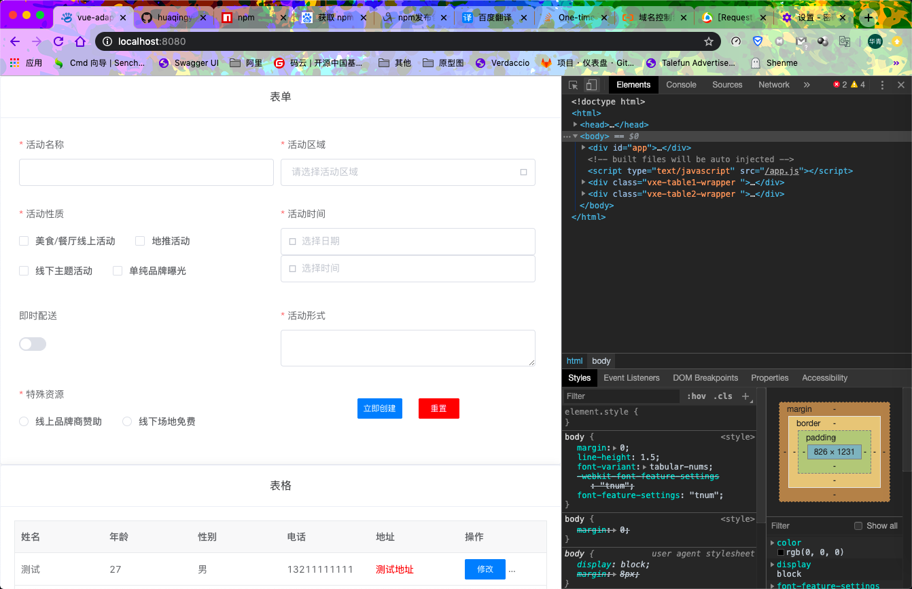
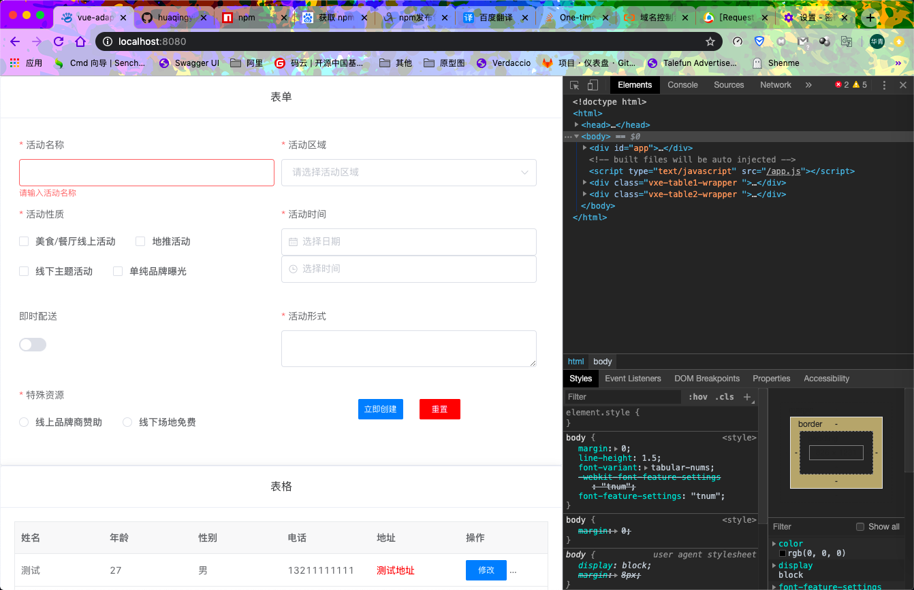
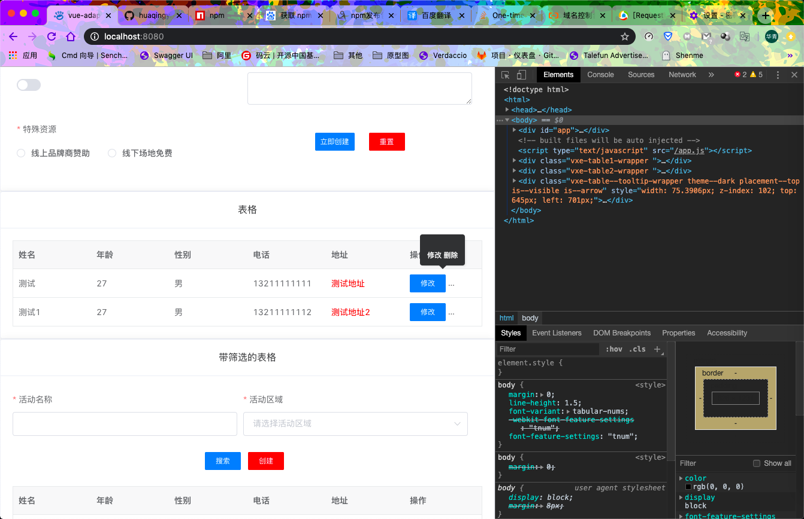
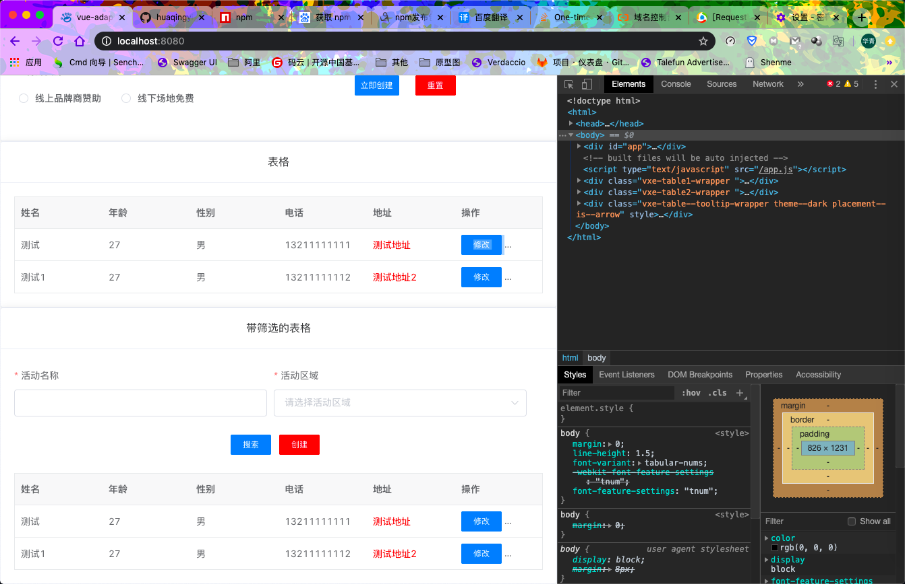
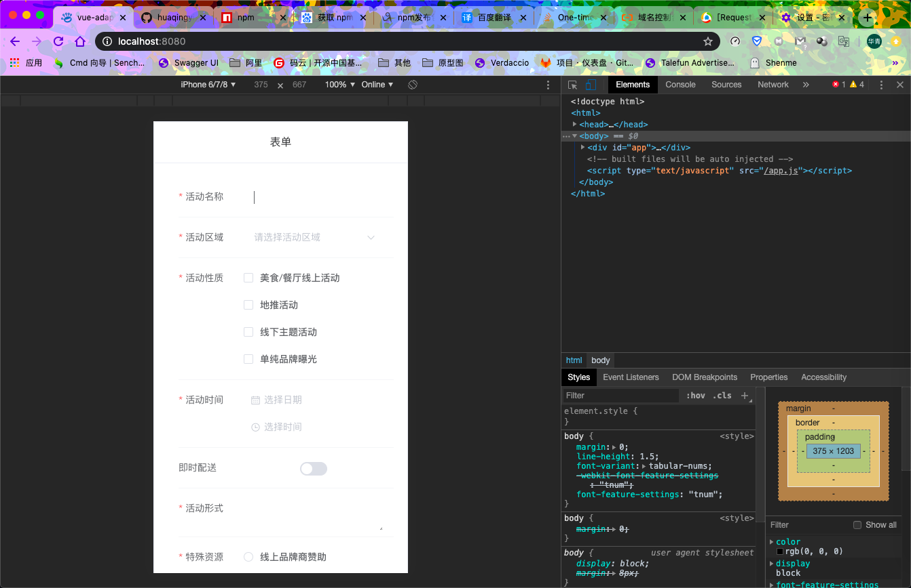
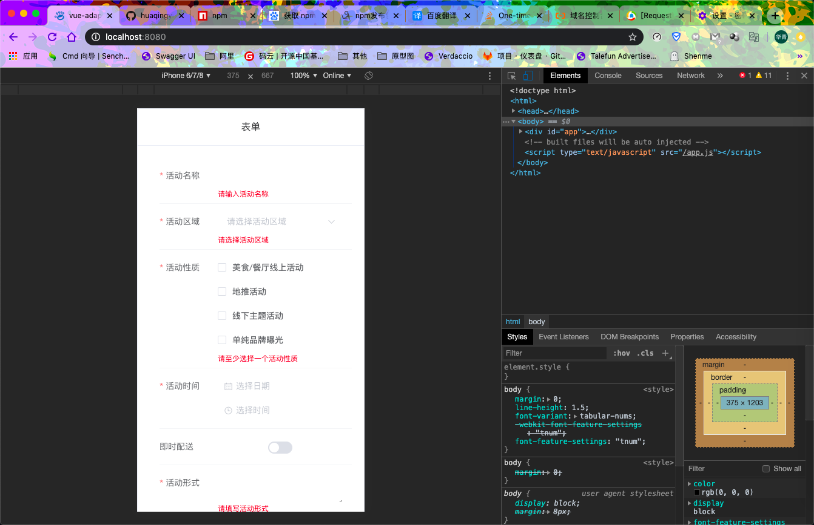
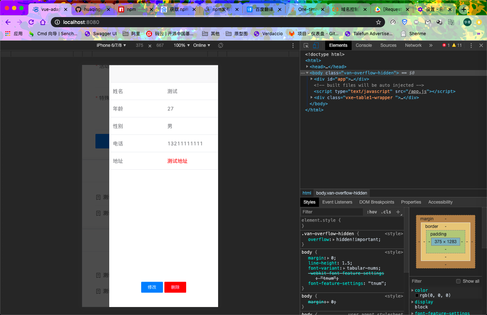
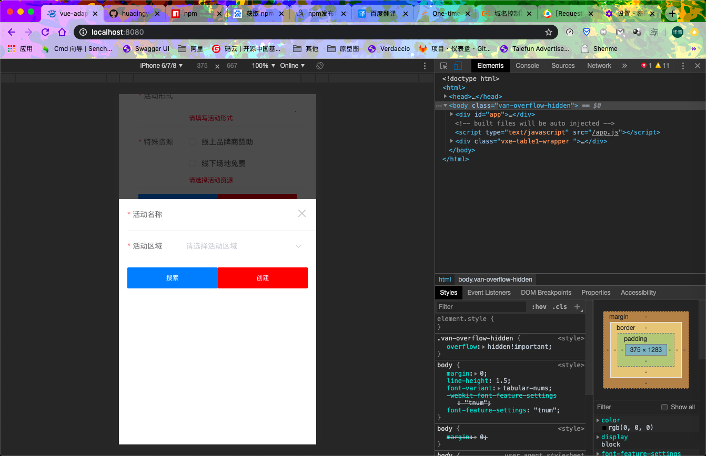

# vue-adapters-platform

## 这是一款吊炸天的响应式适配解决方案
### 话不多说先看图
* PC 效果图




* 移动端 效果图





## Quick Start
```
npm i vue-adapters-platform
```

* 入口文件 main.tsx
```
import Vue from 'vue';
import App from './App.vue';

import ElementUI from 'element-ui';
import 'element-ui/lib/theme-chalk/index.css';

Vue.use(ElementUI);

import { AdapterUI } from '../dist';

Vue.config.productionTip = false;

Vue.use(AdapterUI);

new Vue({
  el: '#app',
  components: { App },
  template: '<App />'
});
```

* 注意一定要带 class name
* 视图层
```
<template>
    <div class="hello">
        <el-card class="box-card">
            <div slot="header" class="clearfix">表单</div>
            <adapter-form-warpper>
                <el-form :inline="true" :model="formData" :rules="rules" ref="ruleForm" label-width="6rem" class="demo-ruleForm">
                    <el-form-item label="活动名称" prop="name">
                        <el-input v-model="formData.name"></el-input>
                    </el-form-item>
                    <el-form-item label="活动区域" prop="region">
                        <el-select style="width: 100%" v-model="formData.region" placeholder="请选择活动区域">
                            <el-option label="区域一" value="shanghai"></el-option>
                            <el-option label="区域二" value="beijing"></el-option>
                        </el-select>
                    </el-form-item>
                    <el-form-item label="活动性质" prop="type">
                        <el-checkbox-group v-model="formData.type">
                            <el-checkbox label="美食/餐厅线上活动" name="type"></el-checkbox>
                            <el-checkbox label="地推活动" name="type"></el-checkbox>
                            <el-checkbox label="线下主题活动" name="type"></el-checkbox>
                            <el-checkbox label="单纯品牌曝光" name="type"></el-checkbox>
                        </el-checkbox-group>
                    </el-form-item>
                    <el-form-item class="group" label="活动时间" required>
                        <el-date-picker type="date" placeholder="选择日期" v-model="formData.date1" style="width: 100%;"></el-date-picker>
                        <el-time-picker placeholder="选择时间" v-model="formData.date2" style="width: 100%;"></el-time-picker>
                    </el-form-item>
                    <el-form-item label="即时配送" prop="delivery">
                        <el-switch v-model="formData.delivery"></el-switch>
                    </el-form-item>
                    <el-form-item label="活动形式" prop="desc">
                        <el-input type="textarea" v-model="formData.desc"></el-input>
                    </el-form-item>
                    <el-form-item label="特殊资源" prop="resource">
                        <el-radio-group v-model="formData.resource">
                            <el-radio label="线上品牌商赞助"></el-radio>
                            <el-radio label="线下场地免费"></el-radio>
                        </el-radio-group>
                    </el-form-item>
                    <el-form-item class="btn center">
                        <div class="btn-item">
                            <adapter-button native-type="button" @click="submitForm('ruleForm')" type="info" size="small">立即创建</adapter-button>
                        </div>
                        <div class="btn-item">
                            <adapter-button native-type="button" @click="resetForm('ruleForm')" type="danger" size="small">重置</adapter-button>
                        </div>
                    </el-form-item>
                </el-form>
            </adapter-form-warpper>
        </el-card>
        <el-card class="box-card">
            <div slot="header" class="clearfix">表格</div>
            <adapter-table :columns="columns" :dataSource="loadData">
                <template v-slot:address="{ value }">
                    <div style="color: red;">{{value}}</div>
                </template>
                <template v-slot:table-option="{ prop }">
                    <adapter-button type="info" size="small">
                        修改</adapter-button>
                    <adapter-button type="danger" size="small">删除</adapter-button>
                </template>
            </adapter-table>
        </el-card>
        <el-card class="box-card">
            <div slot="header" class="clearfix">带筛选的表格</div>
            <adapter-table :columns="columns" :dataSource="loadData">
                <template v-slot:table-search>
                    <adapter-form-warpper>
                        <el-form :inline="true" :model="formData" :rules="rules" ref="ruleForm1" label-width="6rem" class="search-form">
                            <el-form-item label="活动名称" prop="name">
                                <el-input v-model="formData.name"></el-input>
                            </el-form-item>
                            <el-form-item label="活动区域" prop="region">
                                <el-select style="width: 100%" v-model="formData.region" placeholder="请选择活动区域">
                                    <el-option label="区域一" value="shanghai"></el-option>
                                    <el-option label="区域二" value="beijing"></el-option>
                                </el-select>
                            </el-form-item>
                            <el-form-item class="btn center search">
                                <div class="btn-item">
                                    <adapter-button native-type="button" @click="submitForm('ruleForm1')" type="info" size="small">搜索</adapter-button>
                                </div>
                                <div class="btn-item">
                                    <adapter-button native-type="button" @click="resetForm('ruleForm1')" type="danger" size="small">创建</adapter-button>
                                </div>
                            </el-form-item>
                        </el-form>
                    </adapter-form-warpper>
                </template>
                <template v-slot:address="{ value }">
                    <div style="color: red;">{{value}}</div>
                </template>
                <template v-slot:table-option="{ prop }">
                    <adapter-button type="info" size="small">
                        修改</adapter-button>
                    <adapter-button type="danger" size="small">删除</adapter-button>
                </template>
            </adapter-table>
        </el-card>
    </div>
</template>

<script lang="ts">
import Vue from 'vue';
import { Component } from 'vue-property-decorator';
import { AdapterColumn } from '../../dist';

@Component
export default class extends Vue {

    public columns: Array < AdapterColumn > ;
    public formData: any;
    public rules: any;

    constructor() {
        super();

        this.formData = {
            name: '',
            region: '',
            date1: '',
            date2: '',
            delivery: false,
            type: [],
            resource: '',
            desc: ''
        };

        this.rules = {
            name: [
                { required: true, message: '请输入活动名称', trigger: 'blur' },
                { min: 3, max: 5, message: '长度在 3 到 5 个字符', trigger: 'blur' }
            ],
            region: [
                { required: true, message: '请选择活动区域', trigger: 'change' }
            ],
            date1: [
                { type: 'date', required: true, message: '请选择日期', trigger: 'change' }
            ],
            date2: [
                { type: 'date', required: true, message: '请选择时间', trigger: 'change' }
            ],
            type: [
                { type: 'array', required: true, message: '请至少选择一个活动性质', trigger: 'change' }
            ],
            resource: [
                { required: true, message: '请选择活动资源', trigger: 'change' }
            ],
            desc: [
                { required: true, message: '请填写活动形式', trigger: 'blur' }
            ]
        };

        this.columns = [
            { title: '姓名', field: 'name' },
            { title: '年龄', field: 'age' },
            { title: '性别', field: 'sex' },
            { title: '电话', field: 'phone' },
            { title: '地址', field: 'address' },
        ]
    }

    public loadData() {
        return Promise.resolve([
            { name: '测试', age: 27, sex: '男', phone: '13211111111', address: '测试地址' },
            { name: '测试1', age: 27, sex: '男', phone: '13211111112', address: '测试地址2' },
        ]);
    }

    public async submitForm(formName: string) {
        const valid = await new Promise(r => (this.$refs[formName] as any).validate(r));
        if (valid) {
            alert('submit!');
        } else {
            console.log('error submit!!');
            return await false;
        }
    }

    public async resetForm(formName: string) {
        (this.$refs[formName] as any).resetFields();
    }
}
</script>
```
